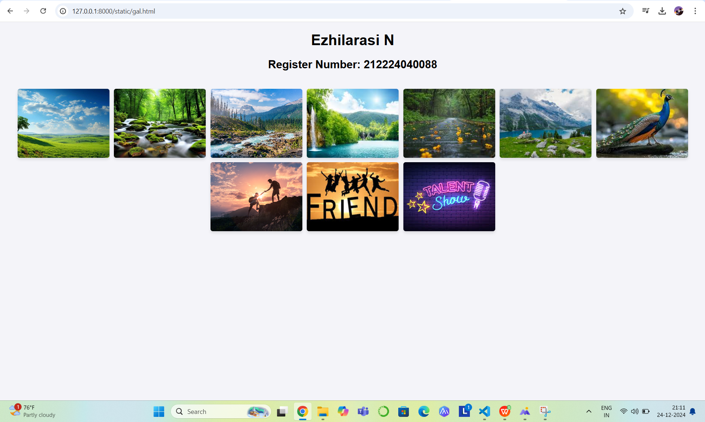
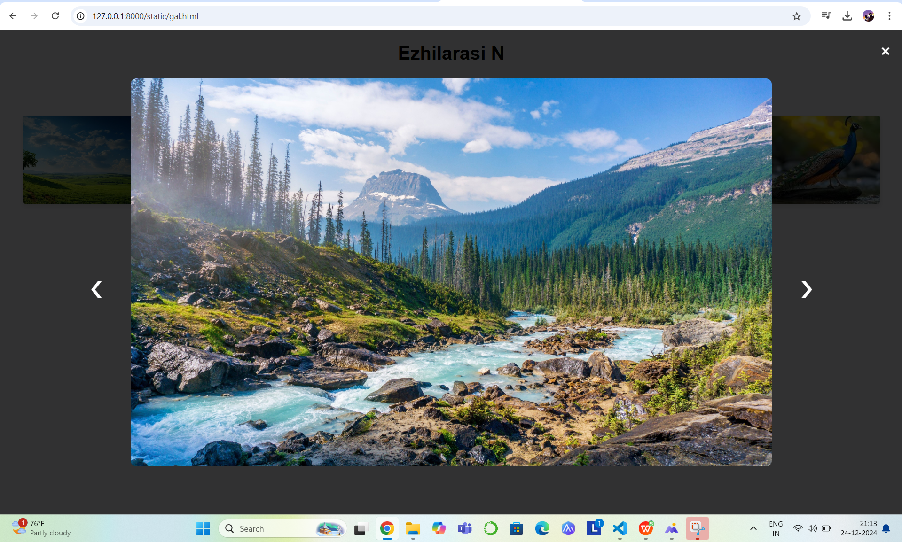
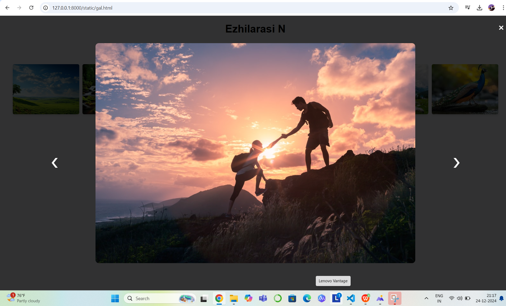
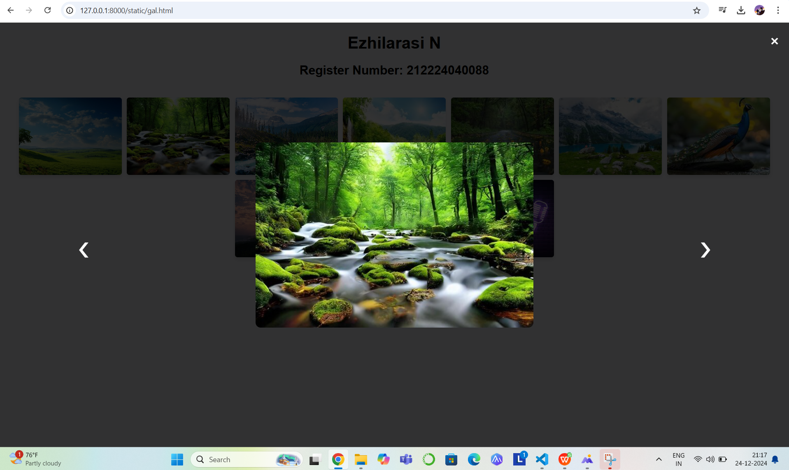
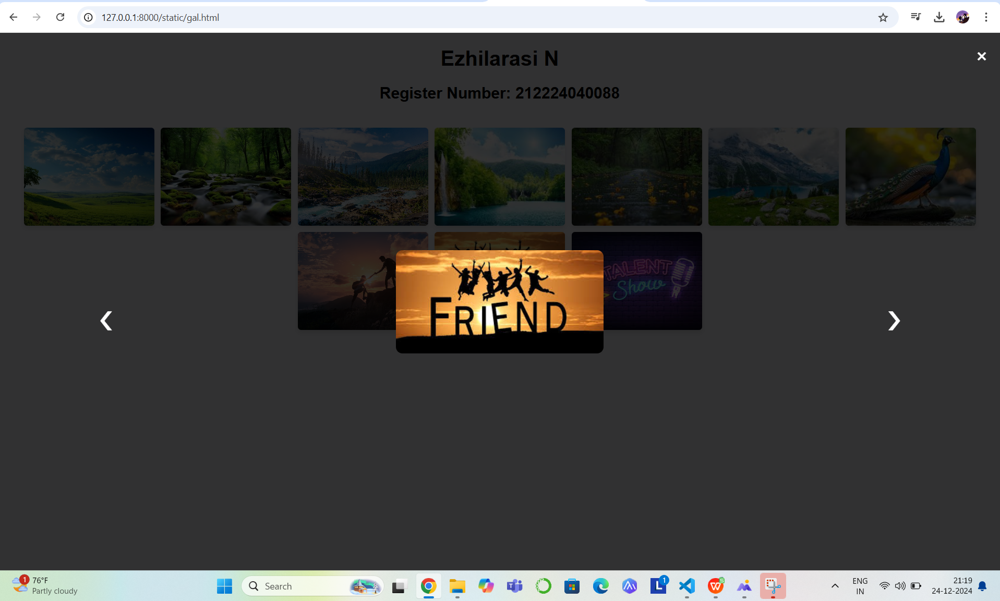

# Ex.08 Design of Interactive Image Gallery
## Date:24.12.2024

## AIM:
To design a web application for an inteactive image gallery with minimum five images.

## DESIGN STEPS:

### Step 1:
Clone the github repository and create Django admin interface.

### Step 2:
Change settings.py file to allow request from all hosts.

### Step 3:
Use CSS for positioning and styling.

### Step 4:
Write JavaScript program for implementing interactivity.

### Step 5:
Validate the HTML and CSS code.

### Step 6:
Publish the website in the given URL.

## PROGRAM :
```
gal.html

<!DOCTYPE html>
<html lang="en">
<head>
    <meta charset="UTF-8">
    <meta name="viewport" content="width=device-width, initial-scale=1.0">
    <title>Interactive Photo Gallery</title>
    <link rel="stylesheet" href="style.css">
</head>
<body>
    <header>
        <h1>Ezhilarasi N</h1>
        <h2>Register Number: 212224040088</h2>
    </header>
    <div class="gallery">
        
        
        
        
        
        
        
        
        
        
        
    </div>

    <div class="modal" id="modal">
        <span class="close" id="close">&times;</span>
        <span class="nav prev" id="prev">&#10094;</span>
        
        <span class="nav next" id="next">&#10095;</span>
    </div>

    <script src="script.js"></script>
</body>
</html>


script.js

const gallery = document.querySelectorAll('.gallery img');
const modal = document.getElementById('modal');
const modalImg = document.getElementById('modal-img');
const closeBtn = document.getElementById('close');
const prevBtn = document.getElementById('prev');
const nextBtn = document.getElementById('next');

let currentIndex = 0;

const showModal = (index) => {
    modal.style.display = 'flex';
    modalImg.src = gallery[index].src;
    currentIndex = index;
};

gallery.forEach((img, index) => {
    img.addEventListener('click', () => showModal(index));
});

closeBtn.addEventListener('click', () => {
    modal.style.display = 'none';
});

prevBtn.addEventListener('click', () => {
    currentIndex = (currentIndex - 1 + gallery.length) % gallery.length;
    modalImg.src = gallery[currentIndex].src;
});

nextBtn.addEventListener('click', () => {
    currentIndex = (currentIndex + 1) % gallery.length;
    modalImg.src = gallery[currentIndex].src;
});

window.addEventListener('click', (e) => {
    if (e.target === modal) {
        modal.style.display = 'none';
    }
});


style.css

body {
    font-family: Arial, sans-serif;
    margin: 0;
    padding: 0;
    background-color: #f4f4f9;

    
}

header{
    text-align: center;
}
.gallery {
    display: flex;
    flex-wrap: wrap;
    gap: 10px;
    justify-content: center;
    padding: 20px;
}
.gallery img {
    width: 200px; /* Fixed width */
    height: 150px; /* Fixed height */
    object-fit: cover; /* Crops and scales images proportionally */
    display: block; /* Removes inline spacing below images */
    cursor: pointer;
    border-radius: 5px;
    box-shadow: 0 4px 6px rgba(0, 0, 0, 0.1);
    transition: transform 0.2s, box-shadow 0.2s;
}
.gallery img:hover {
    transform: scale(1.05);
    box-shadow: 0 6px 8px rgba(0, 0, 0, 0.2);
}
.modal {
    display: none;
    position: fixed;
    top: 0;
    left: 0;
    width: 100%;
    height: 100%;
    background-color: rgba(0, 0, 0, 0.8);
    justify-content: center;
    align-items: center;
    z-index: 1000;
}
.modal img {
    max-width: 80%;
    max-height: 80%;
    border-radius: 10px;
}
.modal .close {
    position: absolute;
    top: 20px;
    right: 20px;
    color: white;
    font-size: 30px;
    cursor: pointer;
}
.modal .nav {
    position: absolute;
    top: 50%;
    color: white;
    font-size: 40px;
    cursor: pointer;
    user-select: none;
}
.modal .prev {
    left: 10%;
}
.modal .next {
    right: 10%;
}

```
## OUTPUT:









## RESULT:
The program for designing an interactive image gallery using HTML, CSS and JavaScript is executed successfully.
